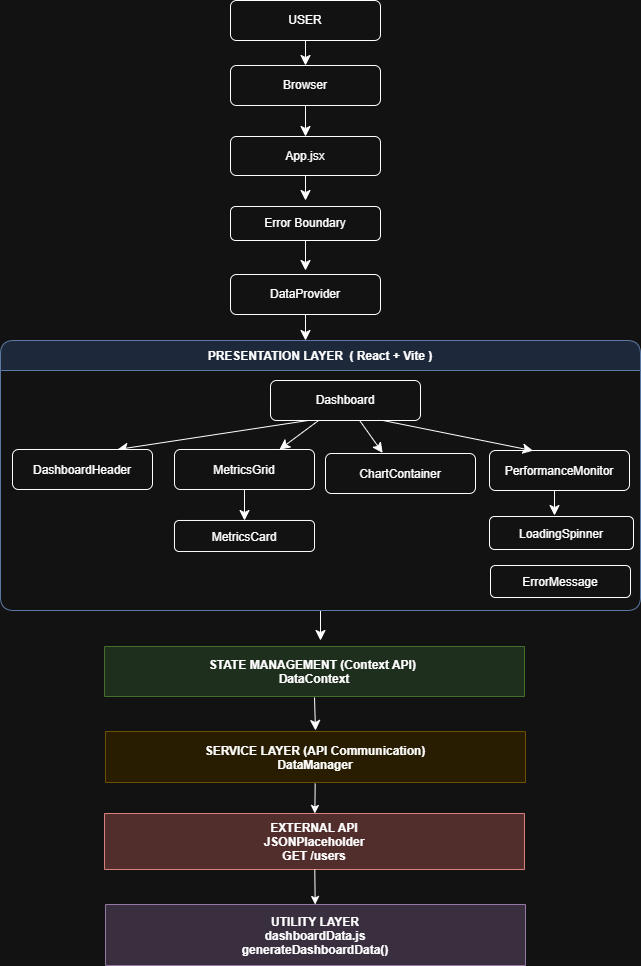
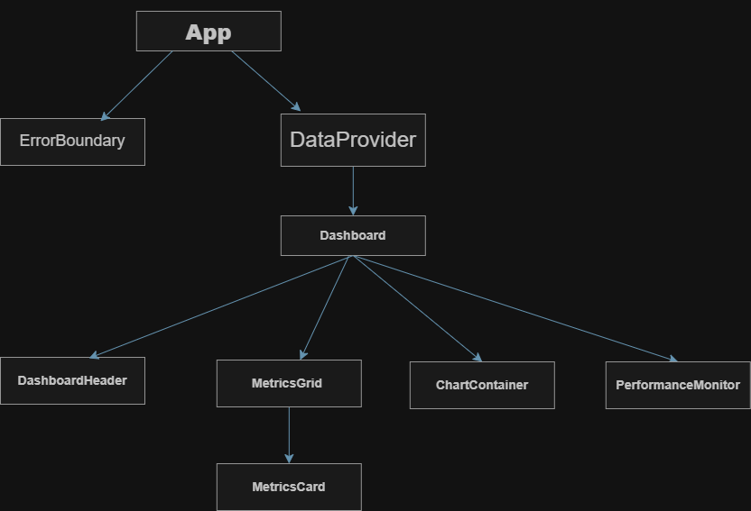
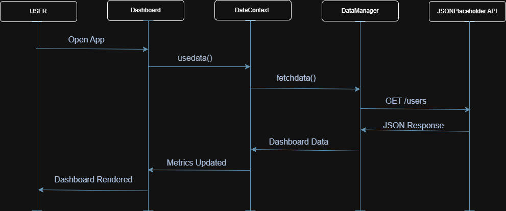
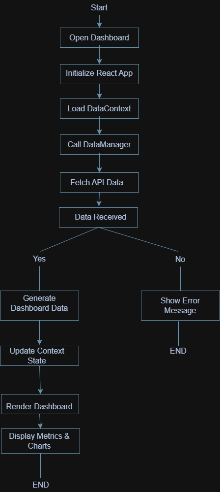
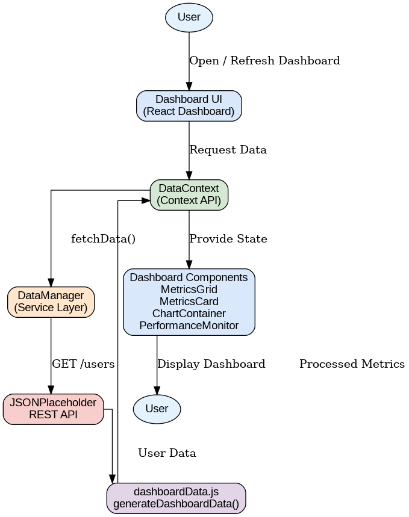

# UML Diagrams

## Overview

This document presents the UML diagrams created for the **Advanced React Dashboard** developed during Week 1 of the Mechlin SDA Advanced Training Program.

The diagrams provide a visual representation of the application's architecture, component relationships, workflow, and data movement, making the system easier to understand, maintain, and extend.

---

# 1. Architecture Diagram

The Architecture Diagram illustrates the high-level structure of the application and shows how different layers interact.

Layers included:

- Presentation Layer (React + Vite)
- State Management Layer (Context API)
- Service Layer (DataManager)
- External API Layer (JSONPlaceholder)
- Utility Layer

---

# 2. Component Diagram

The Component Diagram represents the hierarchy and relationships between the React components used in the application.

Major components include:

- App.jsx
- ErrorBoundary
- DataProvider
- Dashboard
- DashboardHeader
- MetricsGrid
- MetricsCard
- ChartContainer
- PerformanceMonitor
- LoadingSpinner
- ErrorMessage

---

# 3. Sequence Diagram

The Sequence Diagram illustrates how different components communicate during the data loading process.

Sequence:

1. User opens the dashboard.
2. Dashboard requests data from DataContext.
3. DataContext calls DataManager.
4. DataManager fetches data from the JSONPlaceholder API.
5. The response is processed.
6. Context updates the application state.
7. Dashboard renders updated metrics and charts.

---

# 4. Activity Diagram

The Activity Diagram illustrates the workflow of the application from startup to displaying dashboard information.

Workflow includes:

- Application startup
- Context initialization
- API communication
- Data processing
- Dashboard rendering
- Error handling

---

# 5. Data Flow Diagram

The Data Flow Diagram illustrates how data moves throughout the application.

Flow:

User

↓

Dashboard

↓

DataContext

↓

DataManager

↓

JSONPlaceholder API

↓

Dashboard Utilities

↓

Dashboard Components

↓

User

---

# Summary

These UML diagrams collectively describe the design and implementation of the Advanced React Dashboard. They provide visual documentation for the application's architecture, workflow, component structure, and data flow, supporting easier maintenance, onboarding, and future enhancements.