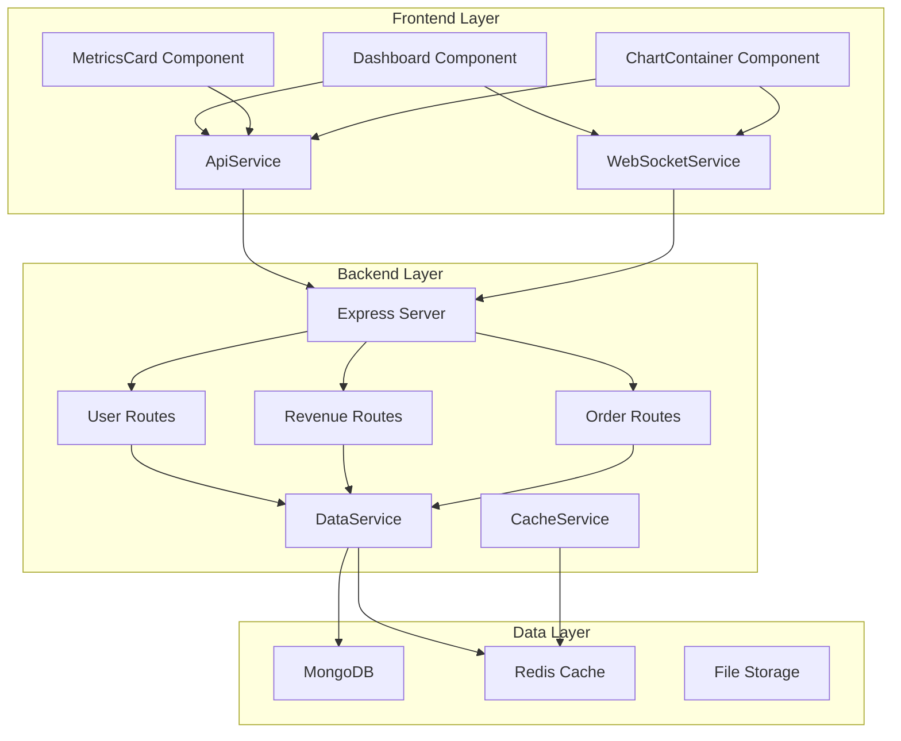

# System Architecture Documentation

## Overview
The Advanced Dashboard is a full-stack web application built with modern technologies to provide real-time data visualization and analytics.

## Architecture Principles
- **Modularity**: Component-based architecture with clear separation of concerns
- **Scalability**: Horizontal scaling capabilities with microservices
- **Performance**: Optimized for speed and efficiency
- **Security**: Secure data handling and authentication
- **Maintainability**: Clean code and comprehensive documentation

## Technology Stack

### Frontend
- **React 18**: Component-based UI library
- **JavaScript ES6+**: Modern JavaScript features
- **CSS3**: Advanced styling with custom properties
- **Chart.js / Recharts**: Data visualization library
- **WebSocket**: Real-time data communication

### Backend
- **Node.js**: JavaScript runtime environment
- **Express.js**: Web application framework
- **MongoDB**: NoSQL database for flexible data storage
- **Redis**: In-memory data store for caching
- **Socket.io / ws**: WebSocket implementation

### DevOps
- **Docker**: Containerization platform
- **Kubernetes**: Container orchestration
- **GitHub Actions**: CI/CD pipeline
- **AWS**: Cloud infrastructure

## System Components

### Frontend Components
```text
src/
├── components/          # Reusable UI components
│   ├── RealTimeDashboard.jsx # Main dashboard component
│   ├── MetricsCard.jsx # Metric display cards
│   └── ChartContainer.jsx # Chart wrapper
├── hooks/              # Custom React hooks
│   ├── useRealTimeData.js # Data fetching & WS logic
│   └── useWebSocket.js # WebSocket management
├── services/           # API and external services
│   ├── ApiService.js  # REST API client
│   └── WebSocketService.js # WebSocket client
└── utils/              # Utility functions
```

### Backend Services
```text
server/
├── routes/             # API route handlers
│   ├── users.js       # User management
│   ├── revenue.js     # Revenue data
│   └── orders.js      # Order processing
├── models/             # Database models
├── middleware/         # Express middleware
└── server.js           # Core App and WS Engine
```

## Data Flow

### 1. User Interaction
- User interacts with dashboard interface
- Frontend components handle user input
- State management updates component state

### 2. Data Fetching
- API service makes HTTP requests to backend
- Backend processes requests and queries database
- Response data is cached and returned to frontend

### 3. Real-Time Updates
- WebSocket connection established
- Backend pushes data updates to frontend
- Frontend components update in real-time

### 4. Data Visualization
- Chart components receive data updates
- Visualization libraries render charts
- User sees updated data in real-time

## Security Considerations

### Authentication
- JWT tokens for user authentication
- Role-based access control (RBAC)
- Secure session management

### Data Protection
- Input validation and sanitization
- SQL injection prevention
- XSS protection
- CSRF protection

### API Security
- Rate limiting and throttling
- Request validation
- Error handling without information leakage

## Performance Optimization

### Frontend
- Code splitting and lazy loading
- Component memoization
- Efficient state management
- Bundle optimization

### Backend
- Database query optimization
- Caching strategies
- Connection pooling
- Load balancing

## System Diagram (UML)


