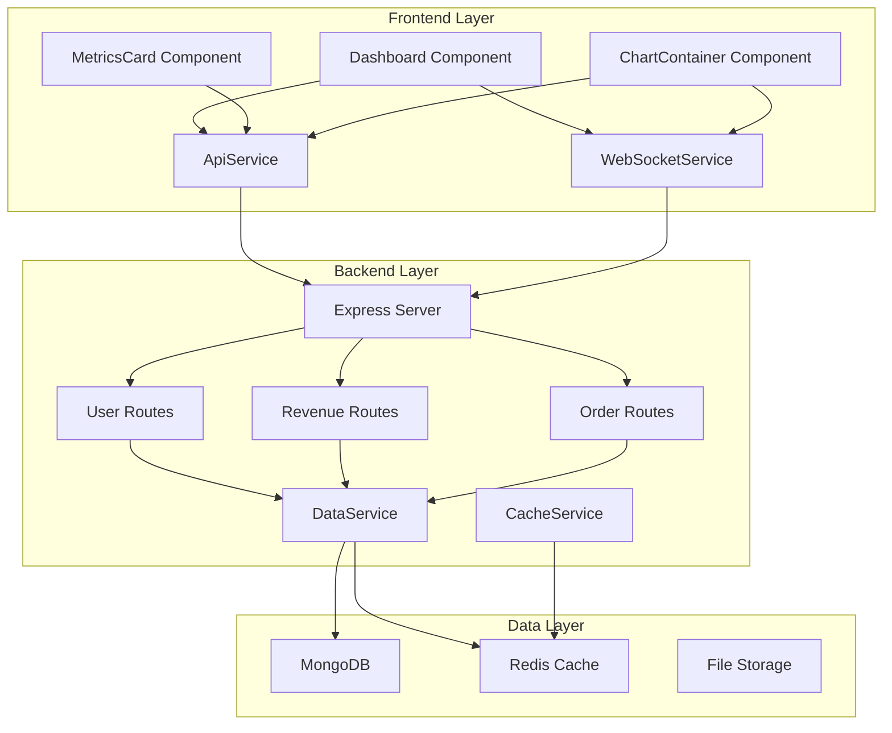

```mermaid
graph TB
    subgraph "Frontend Layer"
        A[Dashboard Component]
        B[MetricsCard Component]
        C[ChartContainer Component]
        D[ApiService]
        E[WebSocketService]
    end
    
    subgraph "Backend Layer"
        F[Express Server]
        G[User Routes]
        H[Revenue Routes]
        I[Order Routes]
        J[DataService]
        K[CacheService]
    end
    
    subgraph "Data Layer"
        L[MongoDB]
        M[Redis Cache]
        N[File Storage]
    end
    
    A --> D
    A --> E
    B --> D
    C --> D
    C --> E
    
    D --> F
    E --> F
    
    F --> G
    F --> H
    F --> I
    
    G --> J
    H --> J
    I --> J
    
    J --> L
    J --> M
    K --> M
```
