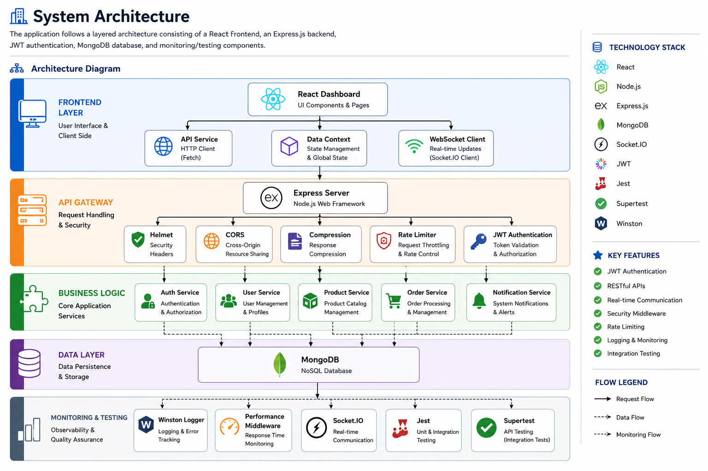

# 🏗️ System Architecture

## Overview

The Week 2 Day 14 Integration Review project follows a **Layered Architecture** that separates the application into independent layers responsible for presentation, request handling, business logic, data persistence, monitoring, and testing.

This architecture promotes:

- Scalability
- Maintainability
- Security
- Performance
- Testability
- Separation of Concerns

---

# 📊 Architecture Diagram



---

# 🧩 Architecture Layers

## 1. Frontend Layer

The Frontend Layer provides the user interface and communicates with backend services through REST APIs and WebSocket connections.

### Components

### React Dashboard

**Responsibilities**

- Displays application pages
- Shows dashboard metrics
- Handles user interactions
- Renders dynamic UI

---

### API Service

**Responsibilities**

- Sends HTTP requests using Fetch API
- Handles API responses
- Manages backend communication
- Centralizes API calls

---

### Data Context

**Responsibilities**

- Global state management
- Shares application data between components
- Eliminates unnecessary prop drilling

---

### WebSocket Client

**Responsibilities**

- Real-time communication
- Receives live notifications
- Listens for Socket.IO events

---

# 2. API Gateway

The API Gateway is built using **Express.js** and acts as the single entry point for all incoming requests.

## Express Server

The Express server is responsible for:

- Request routing
- Middleware execution
- Authentication
- Response generation

---

### Helmet

Provides security by adding HTTP security headers.

---

### CORS

Allows secure communication between frontend and backend applications.

---

### Compression

Compresses responses to improve API performance.

---

### Rate Limiter

Protects APIs against excessive requests and abuse.

---

### JWT Authentication

Handles:

- User authentication
- Token validation
- Authorization
- Protected routes

---

# 3. Business Logic

The Business Logic Layer contains all application services responsible for implementing business rules.

---

## Auth Service

Responsible for:

- User Registration
- User Login
- JWT Token Generation
- Authentication
- Authorization

---

## User Service

Responsible for:

- User CRUD Operations
- User Profiles
- User Management

---

## Product Service

Responsible for:

- Product Catalog
- Product Management
- Product Operations

---

## Order Service

Responsible for:

- Order Processing
- Order Creation
- Order Management

---

## Notification Service

Responsible for:

- System Notifications
- Alert Messages
- Real-time Events

---

# 4. Data Layer

The Data Layer stores all application information using MongoDB.

## MongoDB

Stores:

- Users
- Products
- Orders
- Authentication Information

The application uses **Mongoose** as the Object Data Modeling (ODM) library for MongoDB.

---

# 5. Monitoring & Testing

The Monitoring & Testing layer improves application reliability and software quality.

---

## Winston Logger

Responsible for:

- Application Logging
- Error Logging
- Request Logging

---

## Performance Middleware

Tracks:

- API Response Time
- Request Duration
- Application Performance

---

## Socket.IO

Provides:

- Real-time Communication
- Live Event Broadcasting
- Instant Notifications

---

## Jest

Used for:

- Unit Testing
- Integration Testing
- Test Automation

---

## Supertest

Used for:

- API Endpoint Testing
- End-to-End Testing
- HTTP Request Validation

---

# 🔄 Request Flow

The following sequence illustrates how a client request travels through the application.

```
React Dashboard
        │
        ▼
API Service
        │
        ▼
Express Server
        │
        ▼
Helmet
        │
        ▼
CORS
        │
        ▼
Compression
        │
        ▼
Rate Limiter
        │
        ▼
JWT Authentication
        │
        ▼
Business Service
        │
        ▼
MongoDB
        │
        ▼
JSON Response
        │
        ▼
React Dashboard
```

---

# 💻 Technology Stack

## Frontend

- React
- Fetch API
- Data Context
- Socket.IO Client

---

## Backend

- Node.js
- Express.js
- JWT
- Helmet
- CORS
- Compression
- Express Rate Limiter

---

## Database

- MongoDB
- Mongoose

---

## Monitoring

- Winston Logger
- Performance Middleware
- Socket.IO

---

## Testing

- Jest
- Supertest

---

# ⭐ Key Features

- Layered Architecture
- RESTful API Design
- JWT Authentication
- Secure Middleware
- Request Rate Limiting
- Centralized Logging
- Real-time Communication
- Integration Testing
- Modular Service Architecture

---

# ✅ Benefits of the Architecture

The current architecture provides several advantages:

- Clear separation between frontend, backend, services, and database
- Better code organization and maintainability
- Easy scalability for future features
- Improved application security
- Efficient request processing
- Modular and reusable services
- Easier debugging through centralized logging
- Automated testing support
- Real-time communication using Socket.IO

---

# 🏁 Conclusion

The application is designed using a layered architecture that separates presentation, request handling, business logic, data persistence, and monitoring into independent modules.

The React frontend communicates with the Express.js backend through REST APIs and WebSocket connections. The backend processes requests using middleware, authenticates users with JWT, executes business logic through dedicated services, stores persistent data in MongoDB, and monitors system health through Winston Logger, Performance Middleware, and automated testing with Jest and Supertest.

This architecture ensures that the application remains secure, maintainable, scalable, and ready for future enhancements.